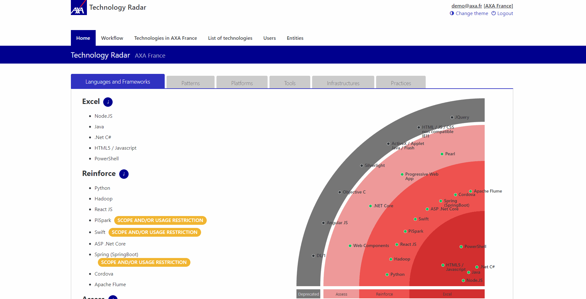

# Technology Radar

    

    

- [About](#about)
- [Getting Started](#getting-started)
- [How Does It Work](#how-does-it-work)
- [Contribute](#contribute)

## About

The AXA Technology Radar is a tool to adopt a proactive posture towards the technological evolutions of the market and the different works of the group.
It is a great way to manage and visualize the usage of technologies.

## Getting Started

- Clone the project
- Modify the src/RadarTechno/appsettings.json and src/RadarTechno/appsettings.development.json to add your MongoDB connection string
- Run with `sh dotnet run --project ./src/RadarTechno/RadarTechno.csproj`
- Run storybook by going to the src/RadarTechno/ClientApp folder and executing `sh npm run storybook`

## How does it work

### Introduction

The Radar is a web application and server developped with .net Core and React. The data is managed with MongoDB.
Technologies must be first created, and then added to an entity with a status.
It is entity-based, meaning that a user in the app belongs to an entity, and the radar displays the technologies bases on their entity status.

### Authentication

The app uses a jwt based authentication. The algorithm used for hashing the password is one of many possibilities to do it, and is not compliant with the standards used by AXA for authentication and password hashing.
The hashing is done with a secret stored in the src/RadarTechno/appsettings.json and src/RadarTechno/appsettings.development.json.

### Technology categories

There are 6 different categories for a technology :

- Languages and Frameworks
- Patterns
- Platforms
- Tools
- Infrastructures
- Practices

### Entity technology status

A technology can have one of the following statuses in an entity :

- Excel
- Reinforce
- Assess
- Deprecated
- Candidate
- Out

Only the Excel, Reinforce, Assess and Deprecated technologies are displayed on the radar.

| Excel                                                                                                                                                                                              | Reinforce                                                                                                                                                             | Assess                                                                                                                                             | -   | Deprecated                                                                                                                                               |
| -------------------------------------------------------------------------------------------------------------------------------------------------------------------------------------------------- | --------------------------------------------------------------------------------------------------------------------------------------------------------------------- | -------------------------------------------------------------------------------------------------------------------------------------------------- | --- | -------------------------------------------------------------------------------------------------------------------------------------------------------- |
| We have capacity to use these solutions and they have already been deployed. We need to reinforce in order to **excel** on these solutions that will be massively deployed or already are critical | Assessments have demonstrated pertinance og these solutions. We have to **reinforce** their usages to relevant use cases and build a capacity on the top of it at AXA | We think these solutions may bring value to AXA. It is necessary to **assess** and to test them in our environment to confirm or this this vision. | -   | For various reasons, these solutions present a risk or a drag to AXA. Usage is **deprecated**. It is necessary to work proactively to decommission them. |

### Technology scope

The scope of a technology can be overloaded by an entity technology scope, so that each entity can have their own scope on a technology. You can do that by simply filling the scope of an entity technology, and it will be displayed on your entity instead of the default technology scope.

### Entity technology urls

You can put custom urls for an entity technology. This is mainly used for assessements, pitches, and other important documents on the lifecycle of a technology in an entity.

### User roles

There are 3 possible roles for a user :

- User
  - Can view its entity's radar
- Admin : an entity administrator
  - Can view its entity's radar
  - Can view and manage its entity's technologies
  - Can view the technology list
  - Can view and manage users from the same entity
- Root: a global administrator
  - Can view its entity's radar
  - Can view and manage its entity's technologies
  - Can view and manage the technology list
  - Can view and manage all entities
  - Can view and manage all users

### Reference entity

The reference entity is the entity deciding the recommended status of technologies. Each technology added to this entity will have its status become the recommended status for other entities.

You can add a reference entity by adding its id in the src/RadarTechno/appsettings.json and src/RadarTechno/appsettings.development.json.

Entity technologies are displayed on the radar following a certain color code depending on the difference of statuses between the entity and the reference entity :

| Status                   | Entity Assess | Entity Reinforce | Entity Excel | Entity Deprecated |
| ------------------------ | ------------- | ---------------- | ------------ | ----------------- |
| **No Reference Status**  | Green         | Green            | Green        | Grey              |
| **Reference Assess**     | Green         | Orange           | Orange       | Grey              |
| **Reference Reinforce**  | Green         | Green            | Green        | Grey              |
| **Reference Excel**      | Green         | Green            | Green        | Grey              |
| **Reference Deprecated** | Red           | Red              | Red          | Grey              |

### Workflow

The workflow tab's purpose is to indicate how users can propose a new technology to the radar.
There is a default process explained but you can modify it to redirect to the url of your choice.
The workflow tab is entity-based, meaning that each entity can have their own workflow.

### Swagger

A detailed documentation is available by accessing the `/swagger` url once the app is running.

### React

- Components are stateless by default
- Components are tested with Storybook
- [React documentation](https://axaguildev.github.io?target=react_toolkit_design)

## Contribute

- [How to contribute](./CONTRIBUTING.md)
- [Please respect our code of conduct](./CODE_OF_CONDUCT.md)
